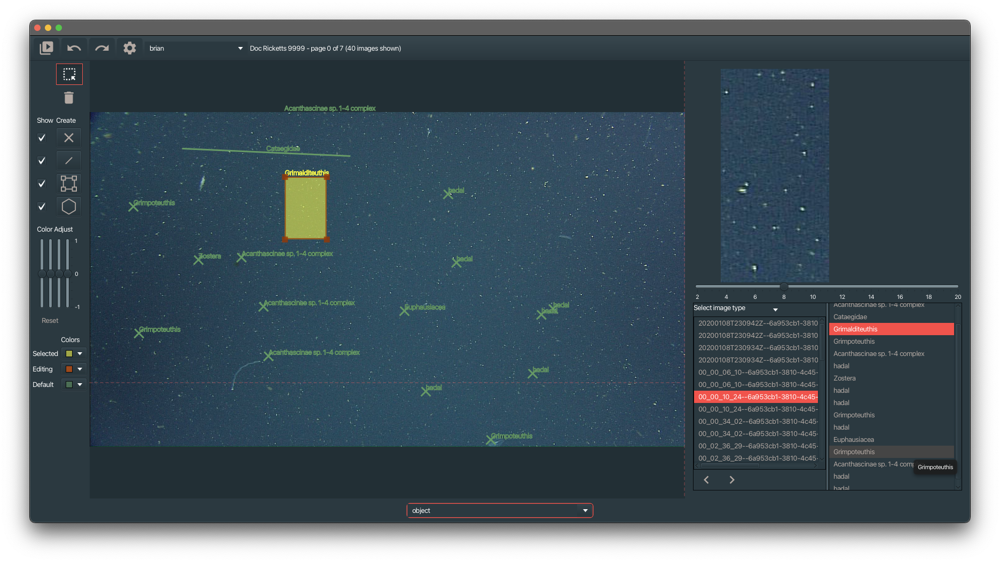

# Mondrian

A VARS Image annotation application. This application is usable, but still in early development.



## Developers

VARS tools Uses libraries in [mbari-org/maven](https://github.com/mbari-org/maven). You can follow the instructions there to allow gradle to fetch the needed libraries or incuded you github user hame and access token in the example below.

```bash
.\gradlew clean jpackage --info -P"gpr.user"=my_github_username -P"gpr.key"=my_github_token
```

### Code signing for Macs

```bash
# You need a Developer ID Application cert from developer.apple.com. A fake id used below
export MAC_CODE_SIGNER="Developer ID Application: blah blah blah (ABC123456)"

cd mondrian

# The build will correctly sign everything if your MAC_CODE_SIGNER is correct
./gradlew clean jpackage --info

cd  mondrian/build/jpackage

# App must be packaged/zipped to be notarized
ditto -c -k --keepParent "Mondrian.app" "Mondrian.zip"

xcrun notarytool submit "Mondrian.zip" \
    --wait \
    --team-id ABC123456 \                      # Found in your Developer ID cert name
    --apple-id <your apple login> \            # Your email you log in to developer.apple.com with
    --password "<your app specific password>"  # You have to use an app password for your account from appleid.apple.com

# We staple to the original app, NOT the zip
xcrun stapler staple "Mondrian.app"

# Remove the old zip file
rm "Mondrian.zip"

# Rezip the app and use that zip to distribute it.
ditto -c -k --keepParent "Mondrian.app" "Mondrian.zip"
```

